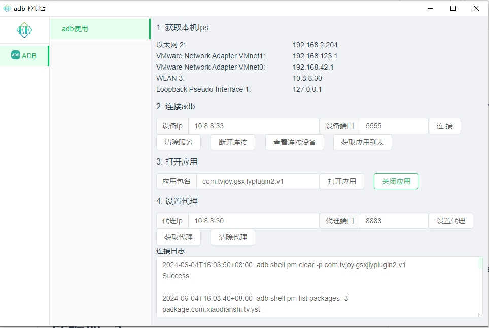

# adbtool工具控制台

[](https://gitee.com/dromara/electron-egg/stargazers)

## 安装
```
npm install

<!-- 安装运行前端项目-->
cd frontend

npm install
```
## 运行
```
npm run dev

```

## 构建
```
<!-- 清空构建目录 -->
npm run clean

<!-- 构建前端项目 -->
npm run build-frontend
<!-- 将前端项目移动到后端项目目录下 -->
npm run rd

<!-- 构建后端项目 -->

npm run build-w 


```
